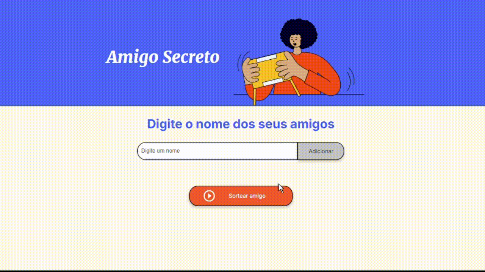

# Challenge Amigo Secreto

#### Este é um projeto que permite aos usuários inserir nomes de amigos em uma lista para, em seguida, realizar um sorteio aleatório e determinar quem é o "amigo secreto". Challenge proposto pelo programa Oracle + Alura, que oferece desafios práticos para aprender e aplicar conceitos de programação em projetos reais.

<br>

## ⚡Funcionalidades
 * Adicionar nomes: Permite adicionar participantes ao sorteio.
   
 * Validar entrada: Se o campo de texto estiver vazio, o programa exibirá um alerta solicitando um nome válido.

 * Visualizar lista de participantes: Exibe todos os nomes adicionados em uma lista.

 * Sortear amigo secreto: Escolhe um participante aleatoriamente e exibe o resultado.

<br>

## 🔧 Como Usar
1. <strong>Clonar o repositório:</strong>
   ```bash
   git clone https://github.com/seu-usuario/amigo-secreto.git
2. <strong>Abrir o projeto: </strong> Abra o arquivo index.html em qualquer navegador.
3. <strong>Adicionar participantes:</strong>
   * Digite um nome no campo de entrada e clique no botão "Adicionar".
   * Os nomes serão listados abaixo.
4. <strong>Sortear amigo secreto:</strong>
   * Clique no botão "Sortear amigo secreto" para exibir um nome aleatório.

<br>

## 🎥 Demonstração

Assista ao funcionamento do projeto no vídeo abaixo:



<br>

## 🌐 Tecnologias Utilizadas

- **HTML**: Estruturação da interface.
- **CSS**: Estilização e layout.
- **JavaScript**: Manipulação do DOM e lógica do sorteio.

<br>

## 🚀 Possíveis Melhorias

- Adicionar funcionalidade para remover nomes da lista.
- Implementar validações para evitar duplicidade de nomes.
